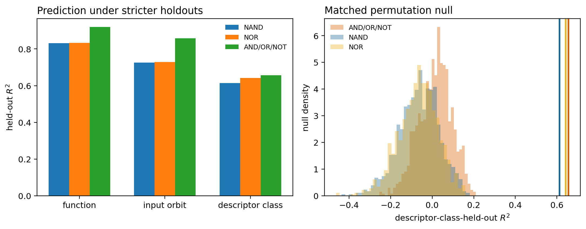
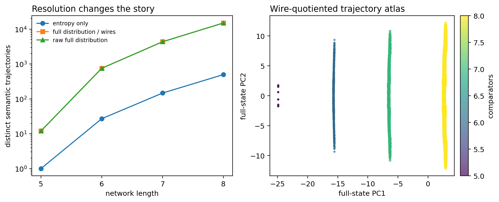

# Results: creativity-atlas validation

## Boolean holdouts and nulls

| Language | Function-held-out R² | Orbit-held-out R² | Descriptor-class-held-out R² | Null p |
|---|---:|---:|---:|---:|
| NAND | 0.831 | 0.726 | 0.613 | 0.0010 |
| NOR | 0.833 | 0.729 | 0.643 | 0.0010 |
| AND_OR_NOT | 0.920 | 0.859 | 0.656 | 0.0010 |

## Sorting geometry

| Length | Entropy profiles | Full trajectories / wire symmetries | Raw full trajectories |
|---:|---:|---:|---:|
| 5 | 1 | 12 | 12 |
| 6 | 27 | 756 | 756 |
| 7 | 147 | 4,356 | 4,356 |
| 8 | 497 | 15,036 | 15,036 |

## Interpretation

The strict holdouts test whether semantic prediction extends beyond near-duplicate functions; the matched null tests whether it exceeds bias, degree, and symmetry. The sorting refinement tests whether the apparent rigidity of optimal entropy profiles survives a higher-resolution semantic representation. Conclusions should follow these stress tests rather than the original optimistic estimates.

