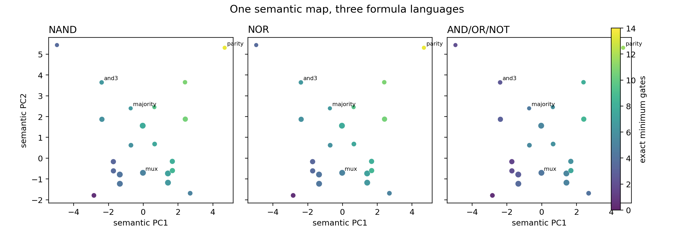

# Results: Boolean semantic atlas

All 256 functions were synthesized exactly in NAND, NOR, and AND/OR/NOT. The same syntax-free semantic coordinates are used in every panel. The 36 exact invariant-descriptor classes occupy 22 visible positions in the two-dimensional projection; point area indicates projected multiplicity and color is mean exact minimum size.

## Cross-language tests

| Metric | Language pair | Spearman rho |
|---|---|---:|
| minimum gates | NAND / NOR | 0.548 |
| minimum gates | NAND / AND_OR_NOT | 0.805 |
| minimum gates | NOR / AND_OR_NOT | 0.805 |
| boundary surprisal bits | NAND / NOR | 0.376 |
| boundary surprisal bits | NAND / AND_OR_NOT | 0.739 |
| boundary surprisal bits | NOR / AND_OR_NOT | 0.739 |
| compression gain | NAND / NOR | 0.264 |
| compression gain | NAND / AND_OR_NOT | 0.612 |
| compression gain | NOR / AND_OR_NOT | 0.601 |

## Semantic prediction

A leave-one-function-out seven-neighbor predictor uses only the semantic descriptors.

| Language | Semantic kNN R² | RMSE | Mean-only RMSE |
|---|---:|---:|---:|
| NAND | 0.831 | 1.047 | 2.546 |
| NOR | 0.833 | 1.039 | 2.546 |
| AND_OR_NOT | 0.920 | 0.560 | 1.980 |

## Interpretation

Persistence of a ranking across languages is evidence for a semantic component; instability is evidence that the chosen syntax prior matters. Compression remains baseline-relative in every language. The atlas therefore tests representation robustness rather than assuming it.

