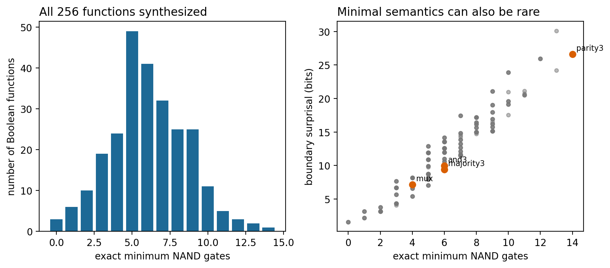

# Results: exact shortest Boolean-expression synthesis

## Complete synthesis

All **256** three-variable Boolean functions are synthesized. The hardest functions require **14 NAND gates** in the ordered formula language. Correctness is verified by exact truth tables and minimality by exhaustive semantic dynamic programming.

## Selected targets

| Target | Minimum gates | Minimal formulas | Boundary surprisal | Canonical gain |
|---|---:|---:|---:|---:|
| and3 | 6 | 288 | 9.97 bits | 3 |
| majority3 | 6 | 432 | 9.38 bits | 193 |
| parity3 | 14 | 373,248 | 26.62 bits | 225 |
| mux | 4 | 24 | 7.15 bits | 203 |

## Interpretation

Across all functions, minimum formula size and boundary surprisal have Spearman $\rho=0.948$. Compression gain relative to the fixed canonical compiler and surprisal have $\rho=-0.037$. A shortest witness for each selected target therefore has mechanically verified correctness, compression against an explicit baseline, and rarity under an explicit syntax prior. Rare but uncompressed formulas and compressed but common semantics remain counterexamples to treating either component alone as creativity.

