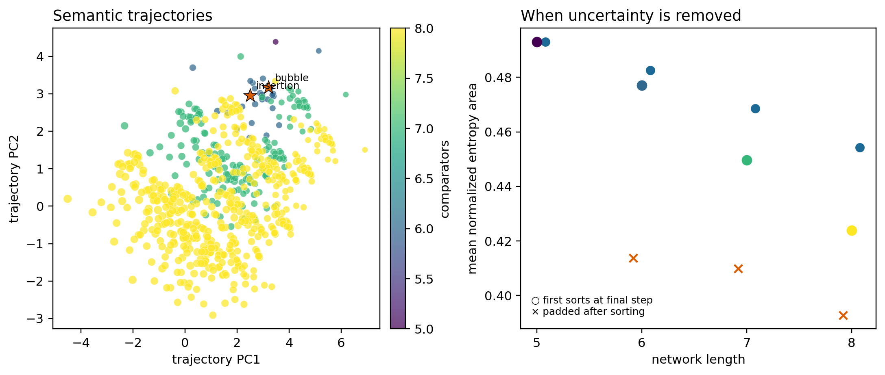

# Results: sorting semantic-trajectory atlas

Every correct four-input comparator sequence of length five through eight was enumerated. The map uses only the entropy curve induced on all 24 inputs.

| Length | Correct sequences | Unique entropy profiles | Correct probability |
|---:|---:|---:|---:|
| 5 | 12 | 1 | 0.001543 |
| 6 | 900 | 27 | 0.019290 |
| 7 | 16,800 | 147 | 0.060014 |
| 8 | 204,120 | 497 | 0.121528 |

## Interpretation

Network length and entropy-curve area have weighted Spearman $\rho=-0.164$. The atlas separates when a network removes ordering uncertainty from whether it eventually sorts. Networks that finish early and then append redundant comparisons become directly visible, while genuine longer solutions trace different routes to the same semantics.

All 12 optimal networks share one entropy trajectory. The padded fractions at lengths six, seven, and eight are 8.0%, 32.1%, and 49.4%, respectively. Thus semantic trajectories diversify rapidly away from the compression boundary.

The trajectory remains representation-dependent: it treats a comparator as the atomic operation and a uniform input permutation as the semantic measure. Its advantage is that these assumptions are explicit and exactly enumerable.

