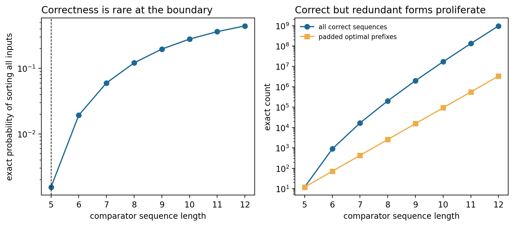

# Results: exact four-input sorting-network creativity test

## Boundary result

All **24** input permutations were verified. The minimum correct network has **5 comparators**; exactly **12** of the **7,776** length-5 sequences are correct. Thus

\[P(\text{correct}\mid L=5)=0.00154321,\qquad -\log_2 P=9.340\text{ bits}.\]

A lexicographically first minimum witness is `[(0, 1), (2, 3), (0, 2), (1, 3), (1, 2)]`. The fixed insertion-network baseline uses 6 comparisons, so the witness has verified structure preservation, a one-comparison compression gain, and exact boundary surprisal.

## Interpretation

Appending any comparator to an already sorted output preserves correctness. The exact counts therefore separate genuinely boundary-compressed networks from large families of correct but redundant programs. This verifies the triad relative to the declared network language and uniform conditional prior; it does not establish a representation-independent notion of creativity.

