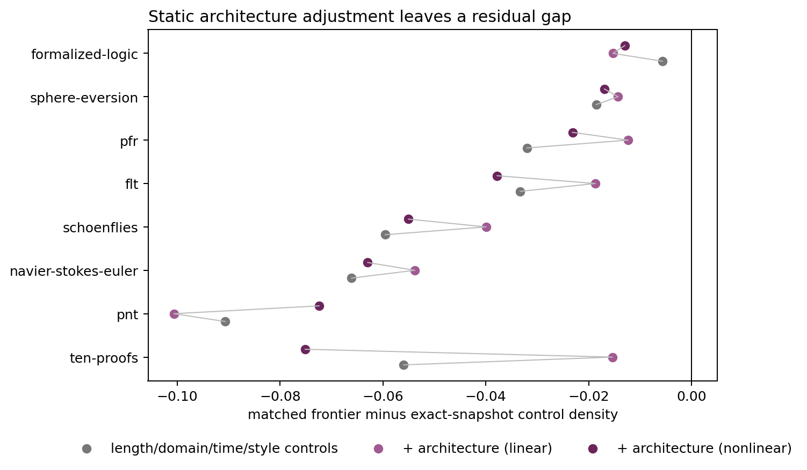

# Results: static abstraction-architecture controls

## Main result

The alpha-normalized project-balanced deficit is **-0.0452**. Within-project fixed-cluster linear adjustment gives **-0.0338** (project-level 95% t interval -0.0596 to -0.0080); a cross-fitted nonlinear adjustment gives **-0.0445** (95% t interval -0.0656 to -0.0235). These represent attenuations of **25.3%** and **1.5%**, respectively.

Thus the apparent explanatory share is model-sensitive: only the linear specification yields material attenuation, while the nonlinear control-trained model leaves the gap essentially unchanged.

Direct architecture matching gives **-0.0505**, but it is not the preferred estimate because several frontier projects have weak common support in the control architecture space.

Mean absolute standardized feature imbalance falls from **0.801** before matching to **0.506** afterward.

## Project effects

| Project | Alpha baseline | Direct match | Linear adjustment | Nonlinear adjustment |
|---|---:|---:|---:|---:|
| ten-proofs | -0.0560 | -0.0951 | -0.0153 | -0.0751 |
| navier-stokes-euler | -0.0661 | -0.0634 | -0.0538 | -0.0630 |
| flt | -0.0333 | -0.0481 | -0.0187 | -0.0378 |
| pfr | -0.0320 | -0.0387 | -0.0123 | -0.0231 |
| pnt | -0.0907 | -0.0848 | -0.1007 | -0.0724 |
| formalized-logic | -0.0057 | -0.0006 | -0.0153 | -0.0130 |
| schoenflies | -0.0596 | -0.0585 | -0.0400 | -0.0550 |
| sphere-eversion | -0.0185 | -0.0152 | -0.0143 | -0.0169 |

## Interpretation

The adjustment measures observable source organization, not formal dependency geometry. A persistent negative effect is evidence against simple module/binder/proof-size architecture as the whole explanation, but the residual still mixes global mathematical vocabulary, elaborated dependencies, author choices, and mathematical novelty. The next discriminating test is an actual dependency-shortcut analysis around major lemmas.
