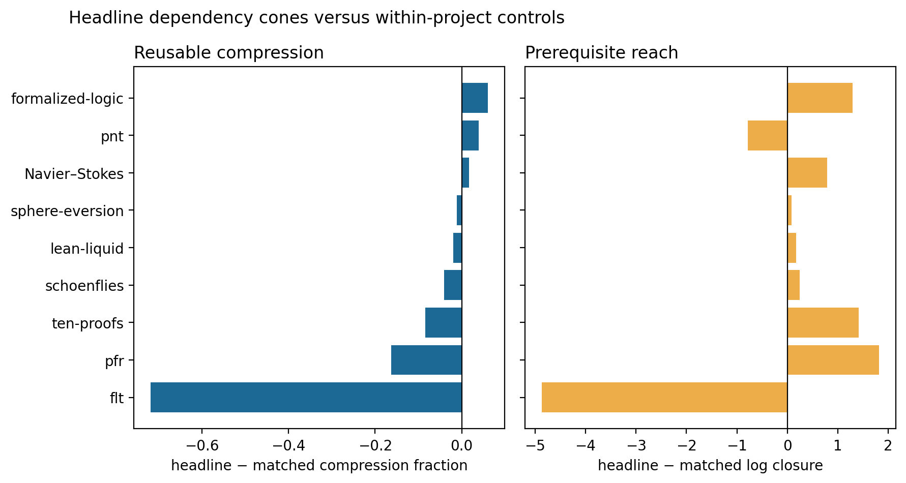

# Results: dependency shortcuts and compression

## Main result

Across the eight modern projects, named headline results have a project-balanced compression-fraction lift of **-0.112** (95% t interval -0.325 to 0.101) relative to declarations matched within project on kind, proof length, source position, file size, and statement length.

Their prerequisite cones have a mean log-closure lift of **-0.002** (-1.787 to 1.783). The reusable-lemma fraction changes by **0.026** (-0.079 to 0.131).

Excluding FLT, whose `p2m_exact_reverting` macro hides its internal dependency chain from this source-static parser, the compression lift is **-0.026** (-0.098 to 0.046). In that sensitivity set, headline cones are **2.25 dependency steps deeper** (0.01 to 4.48).

## Project effects

| Project | Headlines | Compression lift | Log-closure lift | Reusable-fraction lift |
|---|---:|---:|---:|---:|
| flt | 3 | -0.718 | -4.863 | 0.243 |
| formalized-logic | 5 | 0.061 | 1.290 | 0.073 |
| lean-liquid | 2 | -0.020 | 0.169 | -0.011 |
| navier-stokes-euler | 7 | 0.017 | 0.789 | 0.008 |
| pfr | 2 | -0.163 | 1.816 | 0.004 |
| pnt | 3 | 0.039 | -0.786 | 0.116 |
| schoenflies | 1 | -0.040 | 0.245 | -0.026 |
| sphere-eversion | 1 | -0.012 | 0.082 | -0.022 |
| ten-proofs | 12 | -0.084 | 1.411 | -0.190 |

Positive values indicate that the named theorem reaches a larger or more reusable internal library than comparable declarations. Compression lift is the closest tested operational analogue of a useful mathematical shortcut.

## Interpretation

This test distinguishes mere length from architectural leverage: controls are matched on surface size and location, excluded from every headline cone, and evaluated over transitive prerequisites. The current evidence favors deeper integration over exceptional reusable compression. It remains an approximate source-graph result, not an elaborator-certified dependency or a causal measure of mathematical creativity.
