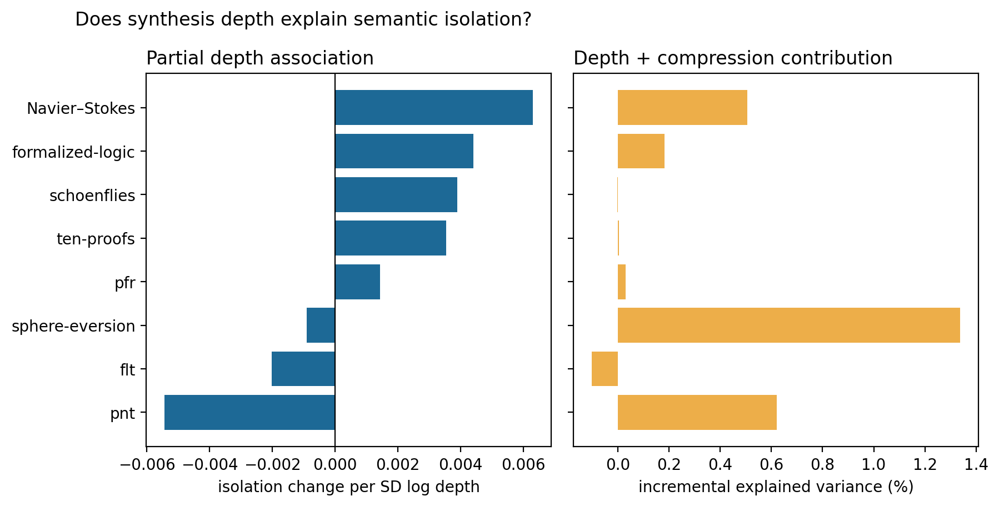

# Results: synthesis depth and semantic isolation

## Main result

Across eight modern projects, one within-project SD of log dependency depth is associated with **0.0014** higher alpha-normalized isolation residual (95% project-level t interval -0.0019 to 0.0047) after the prior architecture controls. The point estimate is **4.1%** of the mean residual frontier gap per SD of depth, but is not distinguishable from zero across projects.

The corresponding compression coefficient is **0.0023** (-0.0014 to 0.0060). Together, depth and compression add **0.32%** five-fold out-of-sample explained variance on average (-0.08% to 0.73%).

## Project effects

| Project | n | Depth coefficient | Compression coefficient | Incremental R² |
|---|---:|---:|---:|---:|
| flt | 2003 | -0.0020 | 0.0033 | -0.0010 |
| formalized-logic | 2505 | 0.0044 | -0.0001 | 0.0018 |
| navier-stokes-euler | 2507 | 0.0063 | -0.0016 | 0.0051 |
| pfr | 910 | 0.0014 | 0.0041 | 0.0003 |
| pnt | 2503 | -0.0054 | 0.0088 | 0.0062 |
| schoenflies | 2501 | 0.0039 | -0.0040 | -0.0000 |
| sphere-eversion | 909 | -0.0009 | 0.0073 | 0.0134 |
| ten-proofs | 2512 | 0.0035 | 0.0005 | 0.0000 |

## Interpretation

The outcome already removes exact-snapshot, coarse semantic-cluster, and statement-length effects. The regression additionally controls observed source architecture. A positive depth coefficient has the predicted sign, but its project-level interval crosses zero and therefore does not establish depth as an explanation of isolation. Lexical graph omissions—especially proof macros—remain the main measurement limitation.
