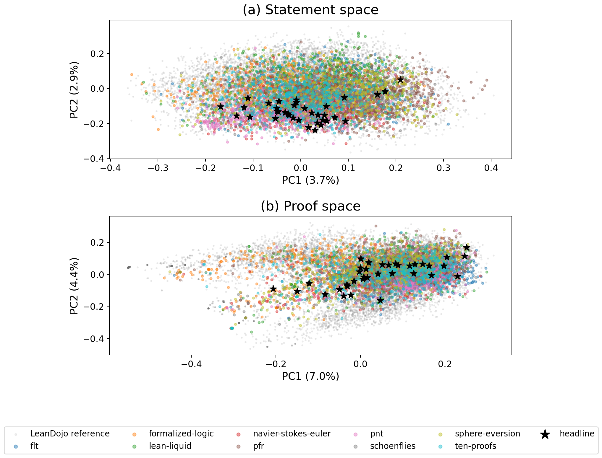

# Results: mapping frontier formalizations

The frozen comparison contains **18,852** frontier declarations and **36** named headline declarations against **10,000** LeanDojo references.

## Main findings

- Frontier statements have mean top-10 LeanDojo similarity **0.6717**, compared with **0.7662** for LeanDojo declarations against the same reference corpus.
- **62.7%** of frontier statements fall below the fifth percentile of LeanDojo's own local statement density.
- Frontier proofs have mean top-10 similarity **0.7030**, compared with **0.7971** in the reference corpus; **60.7%** fall below its fifth-percentile threshold.
- Statement neighborhoods still transfer to proof space: proof similarity along statement-selected neighbors exceeds the random-reference baseline by **0.0565** on average.

## Project summary

| Project | n | Statement top-10 | Below ref. q05 | Proof top-10 | Transfer delta |
|---|---:|---:|---:|---:|---:|
| flt | 2,003 | 0.6726 | 64.1% | 0.7149 | 0.0590 |
| formalized-logic | 2,505 | 0.7122 | 39.4% | 0.7812 | 0.0520 |
| lean-liquid | 2,502 | 0.7044 | 42.1% | 0.7630 | 0.0596 |
| navier-stokes-euler | 2,507 | 0.6432 | 79.2% | 0.6626 | 0.0513 |
| pfr | 910 | 0.6795 | 65.3% | 0.6957 | 0.0657 |
| pnt | 2,503 | 0.6435 | 73.0% | 0.6612 | 0.0630 |
| schoenflies | 2,501 | 0.6684 | 68.7% | 0.6573 | 0.0499 |
| sphere-eversion | 909 | 0.7028 | 40.9% | 0.7249 | 0.0590 |
| ten-proofs | 2,512 | 0.6437 | 80.0% | 0.6781 | 0.0574 |

The statement view is the primary cross-version result. Proof bodies were extracted statically from source and are not equivalent to LeanDojo tactic traces; their comparisons are therefore descriptive.

Machine-readable per-project and headline results are in `artifacts/analysis.json`.
