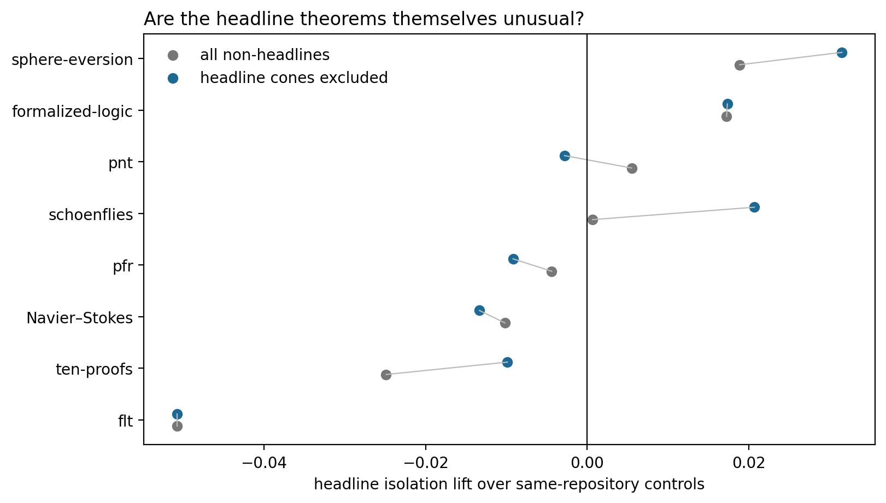

# Results: within-repository headline isolation

## Main result

Across 34 modern headline theorems, the project-balanced vocabulary-anonymized isolation lift over same-repository, same-cluster architecture-matched declarations is **-0.0060** (95% project-level t interval -0.0252 to 0.0133).

After excluding sampled declarations inside any headline prerequisite cone, the lift is **-0.0020** (-0.0235 to 0.0195).

Excluding FLT's macro-wrapped endpoints, the corresponding strict lift is **0.0049** (-0.0116 to 0.0215).

## Project effects

| Project | All controls | Cones excluded |
|---|---:|---:|
| flt | -0.0507 | -0.0507 |
| formalized-logic | 0.0173 | 0.0173 |
| navier-stokes-euler | -0.0102 | -0.0133 |
| pfr | -0.0044 | -0.0092 |
| pnt | 0.0055 | -0.0028 |
| schoenflies | 0.0007 | 0.0207 |
| sphere-eversion | 0.0189 | 0.0315 |
| ten-proofs | -0.0249 | -0.0099 |

## Interpretation

If the interval contains zero, the earlier frontier separation is a repository-level distribution shift rather than a property demonstrated specifically by the named major theorems. A positive lift would instead motivate a concept-combination novelty analysis focused on the headlines.
