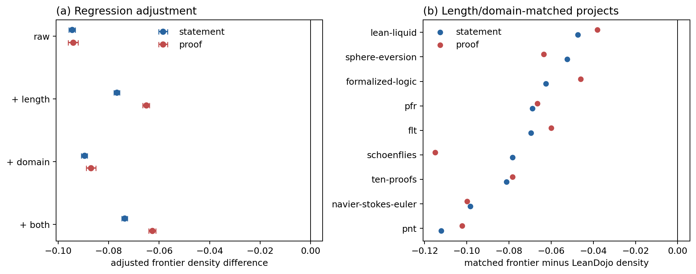

# Results: conditional rarity of frontier formalizations

## Main result

The raw statement-density deficit is **-0.0945** cosine points. After controlling for statement/proof character counts and frozen statement-cluster fixed effects, the deficit is **-0.0737** (HC3 95% CI -0.0748 to -0.0726).
The project-balanced matched estimate is **-0.0745** (95% t interval -0.0905 to -0.0585).

Restricting to matches within 0.5 standardized log-length units retains **90.8%** of frontier declarations and gives a project-balanced statement deficit of **-0.0728**.

Thus observable text length and coarse semantic domain do not explain away frontier isolation. They may attenuate it, but the controlled effect remains a substantial corpus-level shift. All nine projects have negative matched statement effects, so the conclusion is not driven by a single formalization. The project-balanced interval is the preferred uncertainty summary; the narrower HC3 interval conditions on these sampled projects.

## Secondary proof view

The adjusted proof-density deficit is **-0.0627** (HC3 95% CI -0.0641 to -0.0614); the project-balanced matched estimate is **-0.0744**. This comparison is descriptive because the two corpora encode proofs differently.

## Project-matched effects

| Project | n | Statement difference | Proof difference | Median match distance |
|---|---:|---:|---:|---:|
| flt | 2,003 | -0.0695 | -0.0599 | 0.104 |
| formalized-logic | 2,505 | -0.0624 | -0.0460 | 0.058 |
| lean-liquid | 2,502 | -0.0474 | -0.0382 | 0.082 |
| navier-stokes-euler | 2,507 | -0.0983 | -0.0998 | 0.111 |
| pfr | 910 | -0.0689 | -0.0665 | 0.088 |
| pnt | 2,503 | -0.1121 | -0.1021 | 0.085 |
| schoenflies | 2,501 | -0.0784 | -0.1149 | 0.086 |
| sphere-eversion | 909 | -0.0525 | -0.0635 | 0.079 |
| ten-proofs | 2,512 | -0.0812 | -0.0783 | 0.177 |

## Interpretation limits

The result rejects a simple length-only explanation and is robust to a coarse domain control. It does **not** distinguish mathematical novelty from project age, Lean/Mathlib version, authorship, or formalization style. Proof character count is not intrinsic complexity, and cluster adjustment is not a causal design. A time-matched multi-snapshot corpus is required to isolate recency.
