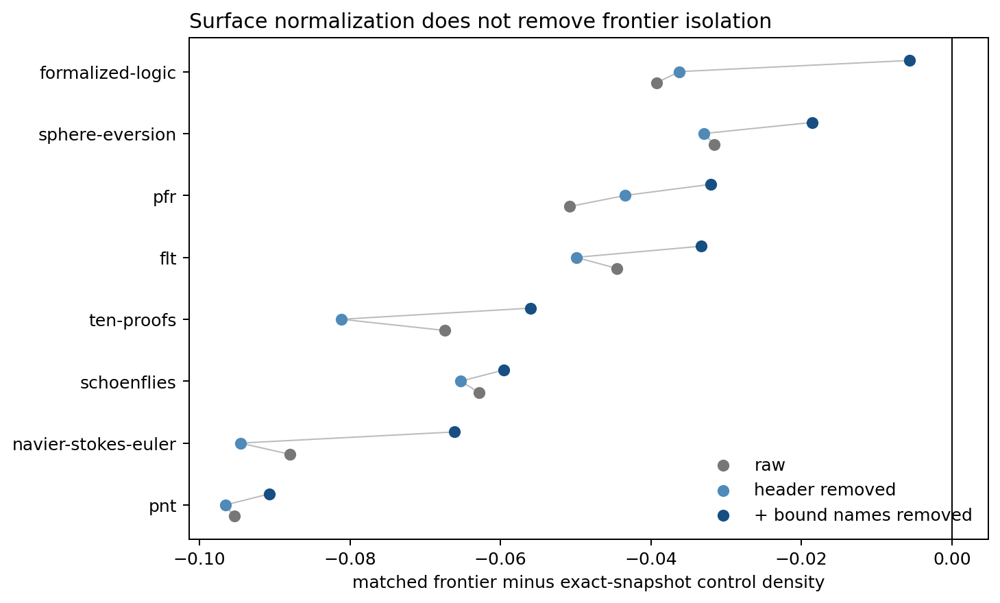

# Results: frontier statement-style ablation

## Main result

With corrected exact-snapshot controls, the raw project-balanced deficit is **-0.0600**. Removing declaration headers and formatting changes it to **-0.0625** (95% t interval -0.0840 to -0.0410); also alpha-renaming bound identifiers changes it to **-0.0452** (95% t interval -0.0685 to -0.0220).

Header normalization increases the gap magnitude by **4.2%**; header plus bound-name normalization reduces the raw gap by **24.6%**. All eight projects remain negatively shifted after both ablations. The response is heterogeneous: `formalized-logic` approaches zero after alpha normalization, whereas PNT and Schoenflies move little.

## Project effects

| Project | Raw | Header removed | + bound names removed |
|---|---:|---:|---:|
| ten-proofs | -0.0674 | -0.0811 | -0.0560 |
| navier-stokes-euler | -0.0880 | -0.0946 | -0.0661 |
| flt | -0.0445 | -0.0499 | -0.0333 |
| pfr | -0.0509 | -0.0434 | -0.0320 |
| pnt | -0.0954 | -0.0966 | -0.0907 |
| formalized-logic | -0.0393 | -0.0362 | -0.0057 |
| schoenflies | -0.0629 | -0.0653 | -0.0596 |
| sphere-eversion | -0.0316 | -0.0329 | -0.0185 |

## Robustness and interpretation

For the alpha-normalized view, a 0.5-SD length caliper retains **95.7%** of declarations and gives a project-balanced effect of **-0.0438**.

The tested surface conventions therefore explain only the reported attenuation. The remaining gap still combines mathematical content, abstraction architecture, global vocabulary, and deeper project conventions; it is not by itself a novelty estimate. Alpha normalization is token-based and should be read as a sensitivity analysis, not a semantics-preserving Lean transformation.
