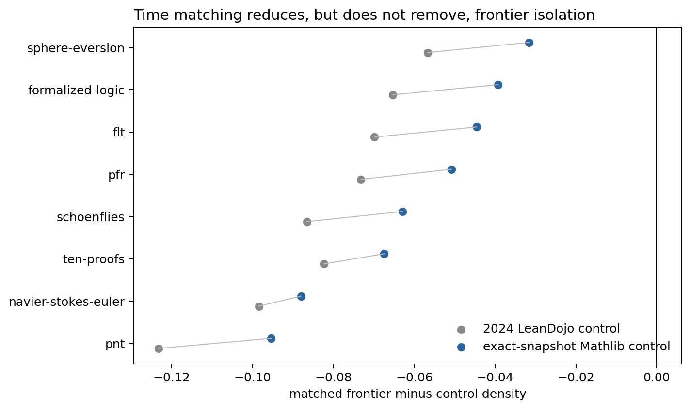

# Results: exact-snapshot time controls

## Main result

Across eight modern projects, the project-balanced frontier deficit relative to changed/new ordinary Mathlib from each project's exact pinned revision is **-0.0600** (95% t interval -0.0791 to -0.0409).
For these same projects, the earlier old-reference matched deficit was **-0.0820**. Time matching therefore attenuates the estimated gap by **26.8%**.

The gap remains negative for 8 of 8 projects. Recency and toolchain drift explain part, but not all, of the observed isolation.

## Project effects

| Project | n | Old control | Exact-snapshot control | Matched control density | Median distance |
|---|---:|---:|---:|---:|---:|
| ten-proofs | 2,512 | -0.0824 | -0.0674 | 0.7111 | 0.034 |
| navier-stokes-euler | 2,507 | -0.0985 | -0.0880 | 0.7312 | 0.015 |
| flt | 2,003 | -0.0698 | -0.0445 | 0.7171 | 0.011 |
| pfr | 910 | -0.0732 | -0.0509 | 0.7304 | 0.011 |
| pnt | 2,503 | -0.1233 | -0.0954 | 0.7389 | 0.000 |
| formalized-logic | 2,505 | -0.0653 | -0.0393 | 0.7515 | 0.000 |
| schoenflies | 2,501 | -0.0865 | -0.0629 | 0.7312 | 0.000 |
| sphere-eversion | 909 | -0.0567 | -0.0316 | 0.7343 | 0.000 |

## Robustness and interpretation

A 0.5-SD length caliper retains **94.2%** of declarations and gives a project-balanced effect of **-0.0569** (95% t interval -0.0749 to -0.0390).

This rejects a pure calendar/toolchain explanation under the measured controls. It does not prove that the residual is intrinsic mathematical novelty: project authorship, local abstraction choices, and formalization conventions remain plausible causes. `lean-liquid` is excluded because its Lean 3 toolchain cannot be cleanly matched to the Lean 4 reference. Corrected controls use the global Embed v4 profile while the frozen reference/frontier arrays use the regional endpoint; a four-statement audit gave mean cross-profile cosine 0.99986.
