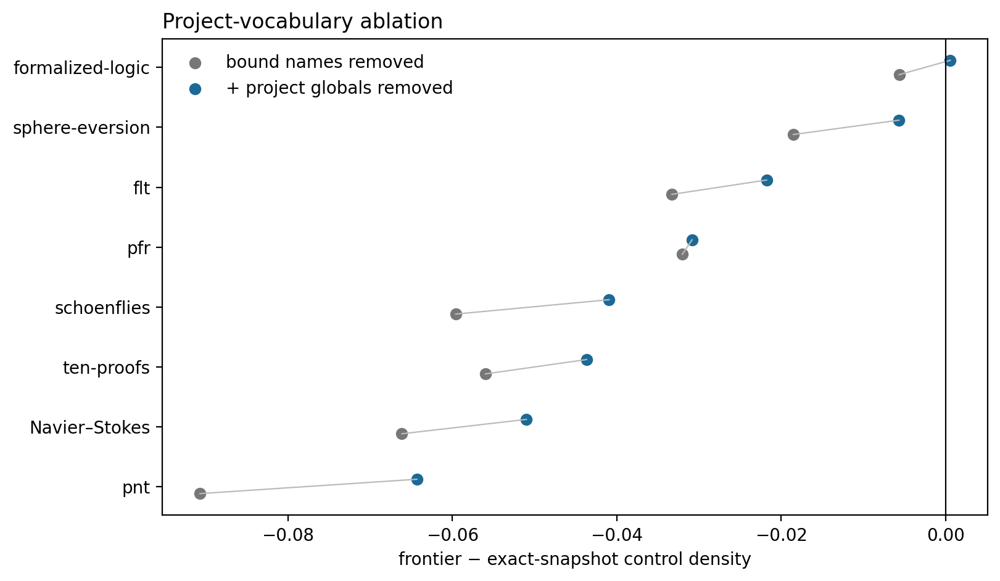

# Results: project-vocabulary ablation

## Main result

The alpha-normalized project-balanced density deficit changes from **-0.0452** to **-0.0322** (95% project-level t interval -0.0508 to -0.0136) after conservatively anonymizing project-defined global identifiers. This is **28.8% attenuation** beyond bound-name normalization and **46.3% total attenuation** from the raw baseline.

## Project effects

| Project | n | Vocabulary-anonymized effect |
|---|---:|---:|
| ten-proofs | 2512 | -0.0437 |
| navier-stokes-euler | 2507 | -0.0510 |
| flt | 2003 | -0.0218 |
| pfr | 910 | -0.0308 |
| pnt | 2503 | -0.0643 |
| formalized-logic | 2505 | 0.0006 |
| schoenflies | 2501 | -0.0409 |
| sphere-eversion | 909 | -0.0057 |

## Interpretation

A large attenuation would support repository dialect as the primary mechanism; a persistent negative gap would show that global-name spelling alone is insufficient. Resolution is conservative, so this test can underestimate the full vocabulary contribution.
